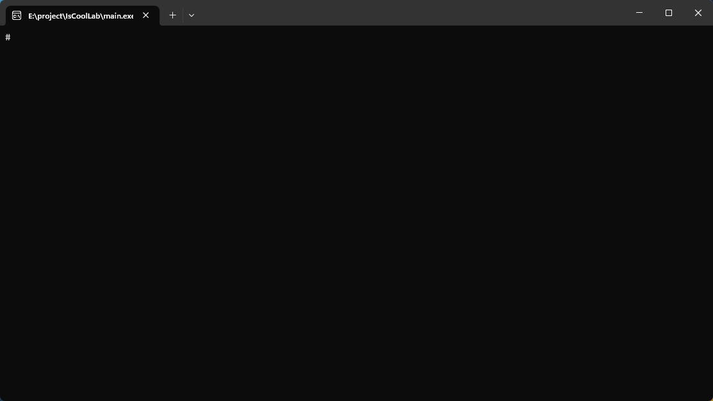
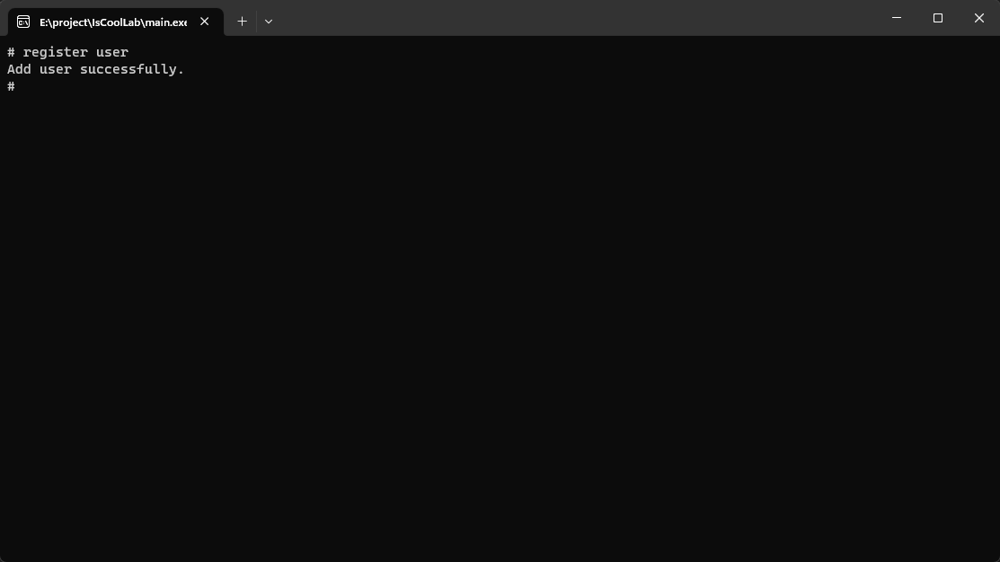
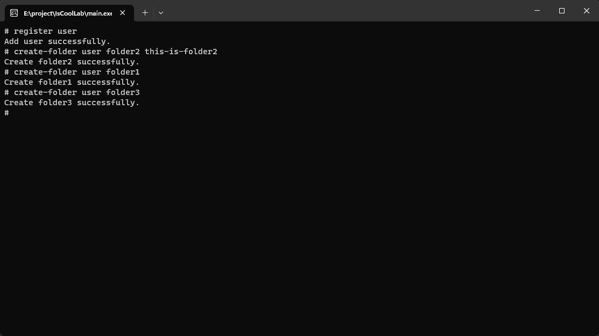
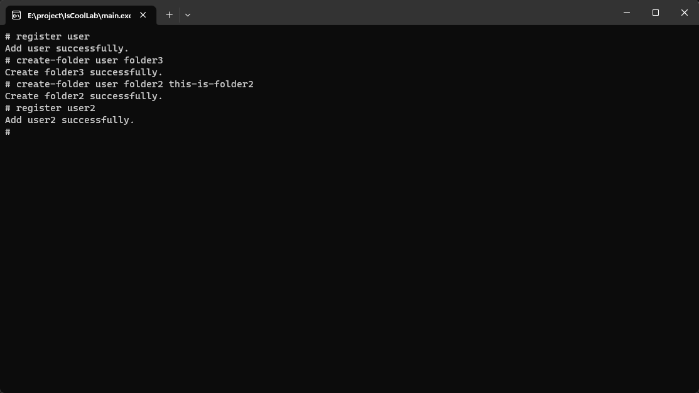
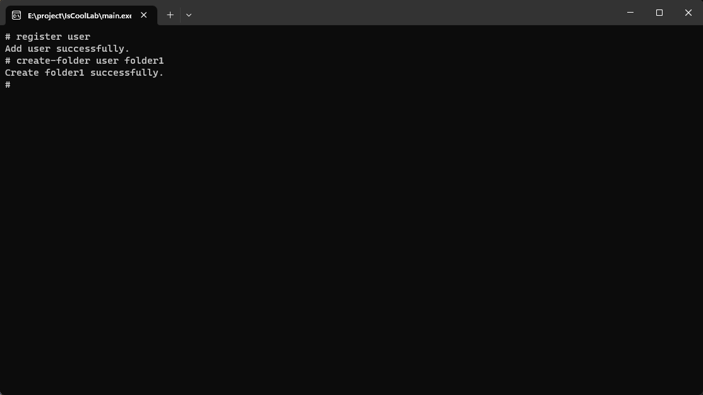
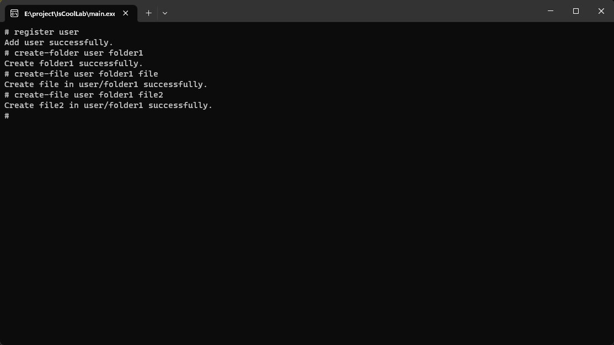
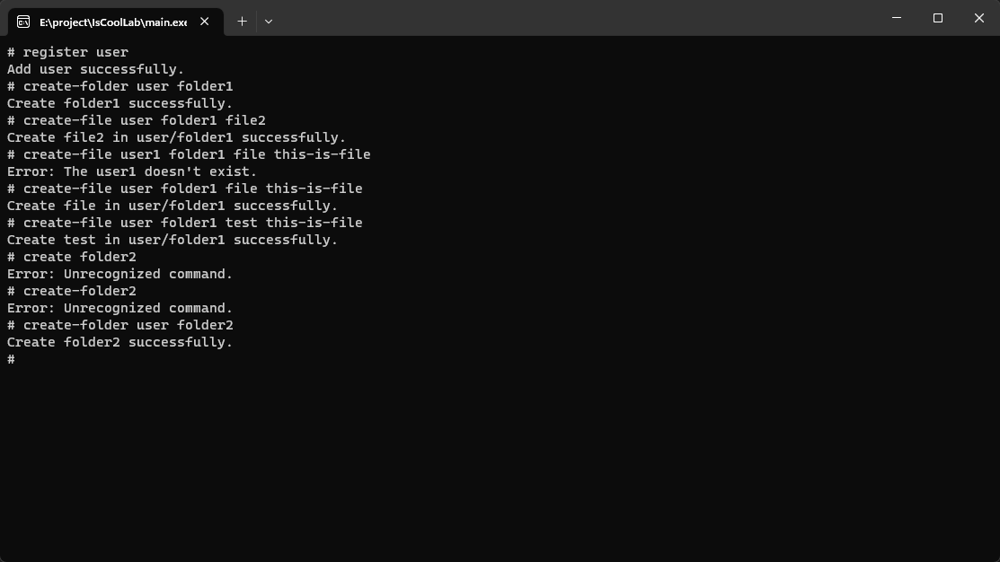

# Project Overview

A virtual file system with user, folder and file management using GoLang 1.20+.

## Table of Contents

- [Main Features](#main-features)
- [Commands](#commands)
- [Contact](#contact)

## Main Features

- Character Validation: Characters that cannot be included are [\\/:*?"<>|\s]. These characters are not allowed in usernames, folder names, or file names.
- Length Validation: Username must not exceed 50 characters, folder name must not exceed 100 characters, and file name must not exceed 255 characters.

## Commands

`register [username]`
 
 

 
 

`create-folder [username] [foldername] [description]?`
 
 

 
 

`delete-folder [username] [foldername]`
 
 

 
 

`list-folders [username] [--sort-name|--sort-created] [asc|desc]`
 
 

 
 

`rename-folder [username] [foldername] [new-folder-name]`
 
 

 
 

`create-file [username] [foldername] [filename] [description]?`
 
 

 
 

`delete-file [username] [foldername] [filename]`
 
 

 
 

`list-files [username] [foldername] [--sort-name|--sort-created] [asc|desc]`
 
 

 
 

## Contact

👨‍💻Wei-Han, Wang
 

📧Email: s13602507586@gmail.com
